# CSC695-Master-Research-on-Neural-Network-Time-Series-Attention-Models

CSC 695 Masters Research

**An Investigation in Chicago City Crime Prediction with RNN plus
Attention Models**

Zhimin Zou

{width="6.5in"
height="4.1666666666666664e-2in"}

{width="5.2652263779527555in" height="6.119792213473316in"}
=================================================================================

Abstract
========

With techniques derived from the state-of-the-art Natural Language
Processing models, a novel Fast Fourier Transformation Attention model
has been crafted to predict the Kernel Density Estimate, KDE, of Chicago
Crime Data. Attention binded with LSTM Encoder Decoder has outperformed
LSTM Encoder Decoder in predictive power for aggregated Chicago crime
occurrences 4 week forecast. With frequency domain based context,
Attention model has been found to be more transparent and insightful
than non-attention models while providing greater performance than its
none-Attention model counterpart.

Introduction
============

Crime is one of the most notable social issues in Chicago. Being able to
visualize the near future occurrence of crime can be a valuable tool for
Chicago Police Department, Hospitals, and Chicago residents. The goal of
this research is to create a model that provides the most accurate
forecast of crime in the form of Kernel Density Estimate, KDE, of crime
occurrences in spatial and time dimensions. With a forecast KDE
visualized as a heat map of near future occurrence of crime, the city of
Chicago will be able to allocate solutions to prevent crimes.

Data Summary
============

Data Source
-----------

The Chicago Data Portal has detailed records of crimes by different
categories but most importantly time and location of the crime from 2001
to today [[\[1\]]{.underline}](#references). Each row of this dataset
represents a single occurrence of a crime.

Data Transformation
-------------------

To achieve a macroscale visualization on the scale of a whole city,
individual instances of crime location are aggregated into a matrix of
25 pixels by 25 pixels for a given time interval range of 30 days. The
method used for this data transformation is the gaussian Kernel Density
Estimate, KDE. Each pixel is assigned a single value that represents the
density of the crime. A time dimension is created by sliding a 30 days
window with increments of 7 days. 52 slices of 25 pixels by 25 pixels
matrix is created as a single sample input into the models with the goal
of predicting 4 slices of 30 days crime aggregate information of 25
pixels by 25 pixels into the future. Each of these 4 slices are shifted
with length 7 days into the future. Approximately 1000 samples were
generated with crime data from January 2001 to June 2020. These 1000
samples are then split between the training set, validation set, and
test set. The data input format is a sequence of 52 and the output data
format is a sequence of 4. This makes the model presented to be sequence
to sequence models. With this format, parallels can be drawn from
inspirational models from the Natural Language Processing domain. Since
time is a continuous sequence, this data format can also be converted to
many to one format. Each time step can be generated autoregressive by
using previously predicted data as input for the next time step. The
choice of choosing sequence to sequence format is based on the ease of
comparison for Attention at a varying range of time of prediction.

Data Exploration
----------------

As part of a data exploration and visualization, a D3.js driven
dashboard built specifically for Chicago Crime Data has been used for
data exploration [[\[2\]]{.underline}](#references). This dashboard
allows the crime to be visualized with context of the street name and
wards by leveraging Mapbox GL technology. Crime heatmap is projected
onto Mapbox in a sliding window of monthly range and monthly interval.
Crime data can be grouped by wards, crime type, and location type. Crime
data can be visualized in time series aggregate in a 24 hours period or
by the whole current year. Seasonality is observed in a 24 hours cycle
and yearly cycle during the data exploration phase of this project.
Trend is observed in the monthly time range with the dashboard explorer.

As part of the model troubleshooting process, autocorrelation and
partial autocorrelation are charted for KDE pixels with the greatest
density. Sample of these charts are in the Appendix A section.
Autocorrelation and Partial autocorrelation charts revealed the
relationship between the most dense crime blocks has high
autocorrelation with lag 1 time step or 7 days intervals and also lag 4
to 6 time steps, which are 28 to 48 day lags. Autocorrelation gave
insight to the understanding of the crime without relation to
neighboring pixels or locations. Traditional ARIMA models will be well
suited if there is no correlation between crime of nearby locations.
However, by intuition and data visualization, there will be correlations
between features or pixels in our data. For this reason, various neural
network models will be used to capture these cross-correlation location
dependencies.

Methods
=======

Various Neural Network models are explored to test the capability of the
predictive power. The loss function used for these models is Mean
Absolute Error, MAE. With the inputs to the model formatted as 52 slices
of KDE and output of the model formatted as 4 slices of KDE, the network
is defined as a sequence to sequence model.

The data set is split into 60 percent of the samples for training, 20
percent for validation, and 20 percent for testing. The training set is
used to generate the min and max scale for min-max scaler to achieve the
value range of 0 to 1.0. This scaler is then applied to the validation
and test set.

*Figure 1a Encoder Decoder Model*
---------------------------------

Encoder Decoder Model
---------------------

The encoder decoder model is the most simple Neural Network sequence to
sequence model. The typical application for this model is Natural
Language Processing, specifically translation. An encoder decoder model
consists of two sections. The first section is a single layer Encoder
LSTM with 100 units. After stepping through 52 slices of the flattened
25 by 25 pixels as time step, the latest hidden state of the Encoder
LSTM out is copied 4 times. This creates 4 slices or time steps which
are then inputted into the Decoder LSTM layer. The decoder LSTM layer is
set to return the full sequence of its hidden states. This allows the
output to create a tensor with dimensions as (sample\_size, time step,
features). See *Figure 1a* for model architecture diagram.

{width="1.3020833333333333in"
height="3.776042213473316in"}The 2 layer LSTM Encoder Decoder model
performed extremely well in capturing the relationship between the time
steps and the relationships between pixels. The validation set MAE is
0.00501 and test set MAE is 0.008138. The average error is less than 1%
of the respective pixel value which can range from approximately 0 to
1.0 after being scaled. Notably, there has been a sharp change in crime
patterns in the test set data due to COVID-19 being in the test set data
as the test set is the last 200 samples of the time series.

The output of this model in validation set is charted as pixel wise time
series to examine the trend, cycle, and seasonal captured by the model.
The prediction for each sample given the pixel number is captured with
the same absolute time for a given time enumeration on x-axis. This is
achieved by padding the front of the predicted pixel wise time series
with empty values to align them to reference the same week for a given
x-axis value. These charts can be found in Appendix B.

Attention Models
----------------

In the recent conception of the Transformer model in Natural Language
Processing, Attention has been researched and applied in a variety of
different fields such as translation, sentence generation, image
generation and time series [[\[3\]]{.underline}](#references). Attention
allows the network to skip superfluous information being propagated in
the training process. The big concept of Attention is assigning weights
to features that are more correlated to efficiently generate the correct
prediction under given context of the prediction.

While there are many parallels in processing time series data versus
processing sentences, NLP style Attention cannot be directly applied to
time series data. There are limitations to traditional attention from
natural language processing in time series. Typically, the weight vector
of Attention is divided between timesteps or in NLP words. The results
of the output for NLP styled Attention is generating a sentence where
each time step is a single word embedding. Specifically, in *NEURAL
MACHINE TRANSLATION BY JOINTLY LEARNING TO ALIGN AND TRANSLATE*
[[\[4\]]{.underline}](#references)*,* context vector $c_{i}$is defined
for each word, i. The attention weight $\alpha_{\text{ij}}$is defined in
word i and annotations j dimensions. In order to generate context, the
annotation j dimension is aggregated together as sum. This collapses
sequential information of previous RNN hidden state $h_{j}$. Each
attention is based on a single time step in RNN hidden state. Using this
style of Attention multivariate time series is limited. A correlation of
many time steps to one time step can certainly be derived in seasonal
forecasting. NLP style Attention mechanism averages information over
multiple time steps, therefore attending to time steps is not the
optimal solution in multivariate time series
[[\[5\]]{.underline}](#references).

Inspired by the 1D-CNN with Attention to features model presented in
*Temporal Pattern Attention for Multivariate Time Series Forecasting*,
leveraging Attention mechanisms to capture important information for
given context. A novel Fast Fourier Transformation, FFT, Attention has
been found to be the most optimal in time series forecasting crime data.
In order to circumvent the limitation of selecting a single relevant
time step for attention weight, *Temporal Pattern Attention for
Multivariate Time Series Forecasting* presented an Attention model that
selects the most relevant time series, which has multiple timesteps
information factored into context vector $c_{i}$. T*emporal Pattern
Attention for Multivariate Time Series Forecasting* highlighted the
limitation of using a single time step since in order to predict time
series patterns, changes in multiple time steps have been factored into
a single time step forecast.

An alternative frequency dimension is generated to circumvent this
limitation. In order to capture the many time steps to one dependency in
Attention mechanism, a summary of the time range's seasonal and trend
information is captured into a vector representation. FFT is used to
achieve this summary of time range seasonal and trend information which
contains multiple timesteps information for a given frequency. FFT is
chosen particularly, for it is a computationally efficient
implementation of Discrete Fourier Transformation, DFT that is widely
available as a standard library.

At a high level, DFT measures the correlation or similarity between the
input time domain data with a discrete set of varying period sinusoidal
functions. These different frequency domain waves are effectively
possible seasons in the input data with incremental variation in
periods. In the equation below, $x\left\lbrack n \right\rbrack$
represents the original discrete time series signal where
$x\left\lbrack n \right\rbrack$ is the value of crime density from 1 to
52 weeks. N is the top range of frequency bins. N is limited to less
than 52 weeks for DFT. For TensorFlow implementation of Real FFT, N is
set to be Nyquist rate, minimum rate which finite bandwidth needs to be
sampled to retain complete information, of 0.5 of sampling time interval
of 52 weeks plus 0 frequency bin which is 27 frequency bins.
Effectively, the 0 frequency bin of the discrete series of DFT is the
mean. The term $e^{- j\frac{2\pi}{N}\text{nk}}$is a standard sinusoidal
wave at the given frequency bin n decomposed in discrete form to match
$x\left\lbrack n \right\rbrack$. The following DFT equation below
measures shows that a similarity measure is taken per frequency bin for
the term $x\left\lbrack n \right\rbrack$ and
$e^{- j\frac{2\pi}{N}\text{nk}}$. Figure 4 below shows two encoder LSTM
cell outputs that demonstrate the time domain versus frequency domain.

DFT:
$X(k) = x\left\lbrack n \right\rbrack e^{- j\frac{2\pi}{N}\text{nk}}$
where k = 0,1,\...N-1 and $x(nT)\  = \ x\left\lbrack n \right\rbrack$

With the 2 layer encoder decoder LSTM model as foundation, Attention
mechanism is applied to the hidden states of the encoder. See *Figure
1b* for model architecture diagram. With the transformed 100 unit
encoder LSTM hidden states from time steps of 52 into frequency domain
of 27, the output of the FFT is a tensor with shape of 27 frequency by
100 LSTM unit where each of the 27 frequency is a summary of the
seasonality at an incremental increase in period by 7 days with 7 days
as the highest frequency and 196 days as the lowest frequency.
Visualization of 52 days of crime KDE at various frequencies is in
Appendix E.

+-----------------------------------+-----------------------------------+
| *H~f~: Frequency domain LSTM      | *f(H~f~,h~t~) = H~f~^T^ W~a~h~t~* |
| hidden states vector*             |                                   |
|                                   | *α~f~ = Sigmoid(f(H~f~,h~t~))*    |
| *W~a~: Dense Layer weights for    |                                   |
| projection*                       | *Attention~out~ = α~f~^T^ H~f~*   |
|                                   |                                   |
| *h~t~: Latest hidden state from   |                                   |
| LSTM*                             |                                   |
+-----------------------------------+-----------------------------------+

In order to attend to LSTM out in frequency domain H~f~, a similarity
measure between the latest encoder LSTM hidden state h~t~ and H~f~. To
keep the output dimension in frequency domain $\Re \in f$, a dense layer
W~a~ is applied to the latest hidden layer in the time domain. The inner
product of H~f~ and W~a~h~t~ is then applied to with the sigmoid
activation function to create a similarity score per frequency to
produce a normalized attention weight $\alpha$. Each LSTM unit frequency
domain vector is then summarized in frequency with the inner product of
$\alpha$ and H~f~ giving each LSTM cell unit aggregate value based on
the most relevant frequencies summed together. This allows pixel wise
information to be represented across multiple time steps.

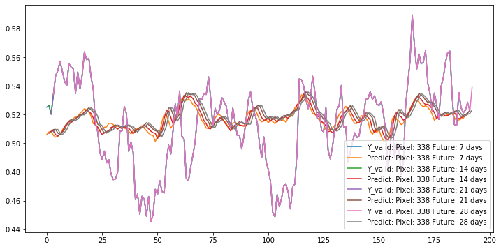{width="6.380672572178478in"
height="8.262153324584427in"}

*Figure 1b: LSTM Attention to Frequency Domain Hidden States*

Both hidden states in time dimension h~t~ and weighted hidden state
Attention~out~ from Attention are then applied with a dense layer and
then concatenated to form the hidden representation for the decoder LSTM
with 100 units. A final dense layer is then applied on the output of the
LSTM unit for transforming the output into the original input feature
shape of 625 pixels or 25 by 25 pixels.

With the encoder decoder architecture, each output time step can be
attended independently with different sets of weights. This allows each
of the decoder LSTM units to focus on different parts of the encoder
LSTM outputs. For output with 4 time steps, 4 different attention heads
are stacked to form a tensor of 4 time steps by 625 pixels out. Although
the model is a sequence to sequence model, it is not autoregressive
where the following sequence is based on the current sequence generated.
All 4 time steps are generated based on the same 52 week of input data.

Results
=======

Models are compared with similar parameters with batch size of 21
samples. Learning rate of 0.001, ADAM optimizer and Mean Absolute Error
for the loss function. Both models are trained with 500 epochs or early
stop on condition of validation MAE does not make further improvement in
the last 50 epochs.

                                                 Train MAE   Validation MAE   **Test MAE**
  ---------------------------------------------- ----------- ---------------- --------------
  LSTM Encoder Decoder 5 Run Average             0.003168    0.00501          **0.008138**
  LSTM Encoder Attention Decoder 5 Run Average   0.003166    0.005014         **0.00805**

*Figure 2: Model Performance Comparison*

The LSTM Encoder Decoder with Attention matched the performance of a
LSTM Encoder Decoder. Within 5 runs, the Attention model slightly
surpassed Encoder Decoder model by 1.1 percent. While this is not
significant in predictive power, Attention models provide more insight
into the data and model themselves.

After weights are trained, validation set is used to chart the Attention
weights vector $\alpha$.

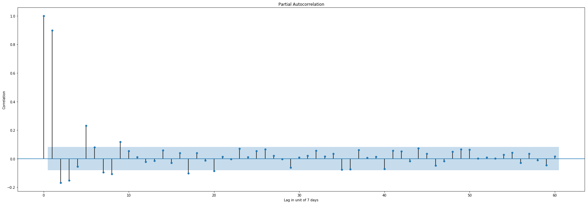{width="6.5in" height="3.3472222222222223in"}

*Figure 3a. Attention on LSTM frequency*

Figure 3a above shows Attention weights $\alpha$ with respect to
frequency on the 7 days future prediction. Each individual line
represents trained Attention weight for a given single sample of 52
weeks. There is significant Attention on higher frequency for predicting
the next 7 days into the future. In other words, the higher frequency
updates in the time dimension of 52 weeks are significantly contributing
to making near term 7 days predictions. The higher frequencies from the
FFT output vector represent correlation values of shorter period time
series changes in encoder LSTM out. The function of the encoder is to
transform the current time step information to generate the encoder
vector. The encoder LSTM time step outputs are directly correlated to
the input time step values. Information of the latest value change is
captured in this encoded vector. By observing the model looking at short
term fluctuations instead of long term seasonality and trends, it can be
concluded that predictions are made based on near term training data.
This result is consistent with the autocorrelation plot of the
validation set provided in Appendix A, where the significant
autocorrelation lags of each pixel in KDE map is within 5 to 6 weeks.

> 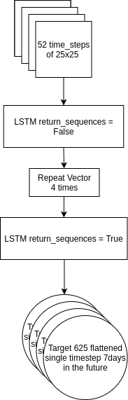{width="6.046875546806649in"
> height="2.1028390201224845in"}
>
> {width="6.067708880139983in"
> height="2.1295319335083116in"}

*Figure 3b. ACF and PACF of the Densest Pixel*

The Attention weights are charted for 14 days, 21 days, and 28 days into
the future in Appendix G. There are no significant changes in the
Attention distribution as the prediction period moves into the more
distant future.

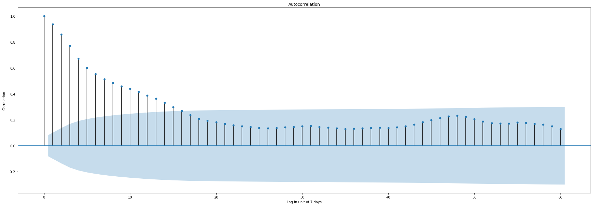{width="6.213542213473316in"
height="3.767146762904637in"}

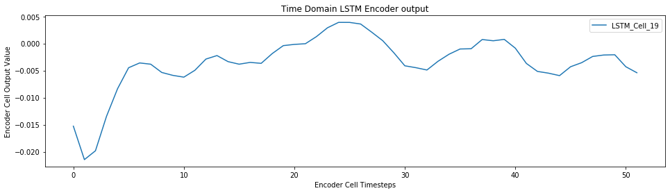{width="6.5in" height="3.9444444444444446in"}

*Figure 4: Time vs Frequency Domain with labeled peaks*

Further examining the encoder portion of Attention FFT model revealed
specialization of each encoder LSTM cell in capturing a unique set of
input information. Above plots in Figure 4 are outputs from encoder LSTM
cells that capture approximately singular frequency that can be easily
visually identified. Closely observing the rest of the encoder LSTM cell
output in time and frequency domain in Appendix F, it can be found that
each encoder LSTM cell output specialized in a particular set of model
inputs as visualization shows there are variations in time step patterns
being outputted by the LSTM cell unit.

*NEURAL MACHINE TRANSLATION BY JOINTLY LEARNING TO ALIGN AND TRANSLATE
2015 [[\[4\]]{.underline}](#references),* revealed performance
comparison of the test set results for sentence translation with
sentence length from 0 to 60 word count. It was found that the Attention
model starts to outperform RNN Encoder Decoder model at translating
sentences that contain 20 or more words with training data containing up
to 50 words. Since each word is a time step in sequence to sequence
sentence translation is a single word, this is equivalent to having
autocorrelation between aggregated crime data that are approximately 50
time steps apart. With the tested data format of 7 days as a single time
step, the benefit of Attention did not present itself.

As a post-mortem reflection to the existing comparison of the two models
and the tested data format, Attention models may see stronger predictive
power compared with Encoder Decoder RNN model, when time step is reduced
to a single day from a 7 day window. This shortened time step format
would require the model to recall events in a 7 time longer sequence as
autocorrelation lags are exacerbated by the shortened time step unit.

Conclusions
===========

A novel Encoder Decoder and Attention model is tested and compared with
the Chicago crime data. The result matched and slightly improved on a
layer LSTM Encoder Decoder model. Attention model did not provide
significant improvements in predictive power for Chicago crime density
in time series. This is due to the lack of long term dependencies in
crime occurrences. Crime occurrences typically autocorrelate with the
past 5 to 6 weeks of its past history at a given aggregate location.
Attention model provided transparency over traditional RNN models.

References
==========

\[1\] \"Crimes - 2001 to Present \| Socrata API Foundry.\" 30 Sep. 2011,
[[https://dev.socrata.com/foundry/data.cityofchicago.org/ijzp-q8t2]{.underline}](https://dev.socrata.com/foundry/data.cityofchicago.org/ijzp-q8t2).
Accessed 9 Aug. 2020.

\[2\] Zou, Zhimin, et al. "Chicago Crime Data." Chicago,
[[https://chicago-crime-data-468.herokuapp.com/]{.underline}](https://chicago-crime-data-468.herokuapp.com/).
A Dashboard for Visualizing Chicago Crime

\[3\] Vaswani, A., et al. \"Attention is all you need. arXiv 2017.\"
*arXiv preprint arXiv:1706.03762* (2017).

\[4\] Bahdanau, Dzmitry, Kyunghyun Cho, and Yoshua Bengio. \"Neural
machine translation by jointly learning to align and translate.\" *arXiv
preprint arXiv:1409.0473* (2014).

\[5\] Shih, Shun-Yao, Fan-Keng Sun, and Hung-yi Lee. \"Temporal pattern
attention for multivariate time series forecasting.\" *Machine Learning*
108.8-9 (2019): 1421-1441.

 
=

Appendices
==========

A.  Autocorrelation and Partial Autocorrelation of training set ordered
    > from the densest pixel

> {width="6.5in"
> height="2.263888888888889in"}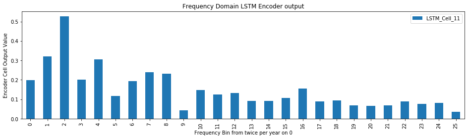{width="6.5in"
> height="2.2777777777777777in"}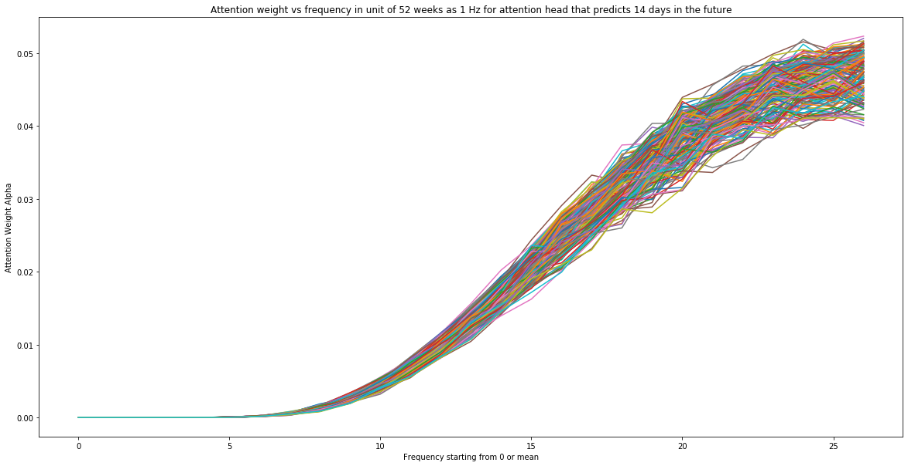{width="6.5in"
> height="2.263888888888889in"}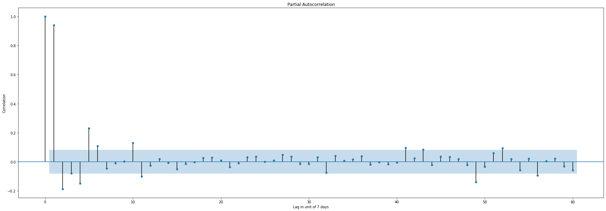{width="6.5in"
> height="2.263888888888889in"}{width="6.5in"
> height="2.25in"}{width="6.5in"
> height="2.263888888888889in"}{width="6.5in"
> height="2.263888888888889in"}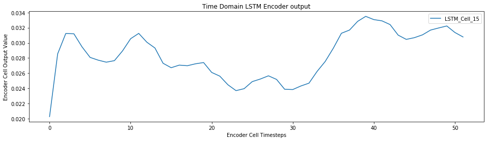{width="6.5in"
> height="2.263888888888889in"}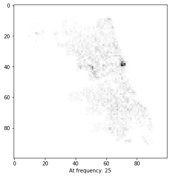{width="6.5in"
> height="2.263888888888889in"}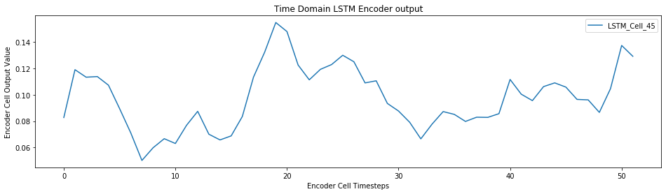{width="6.5in"
> height="2.263888888888889in"}

B.  Pixel wise time series of validation set prediction X-axis: timestep
    > unit of 7 days. Y-axis scaled
    > KDE.{width="6.5in"
    > height="3.2083333333333335in"}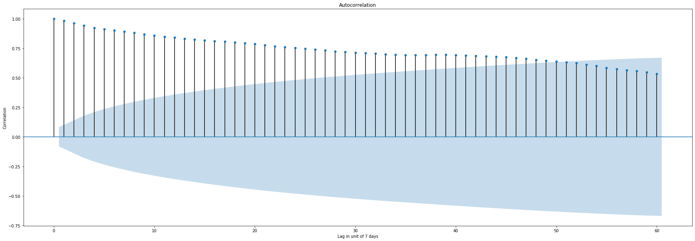{width="6.5in"
    > height="3.2222222222222223in"}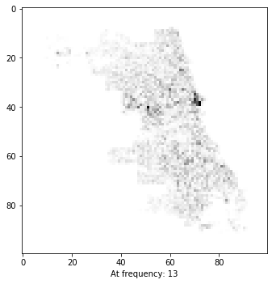{width="6.5in"
    > height="3.236111111111111in"}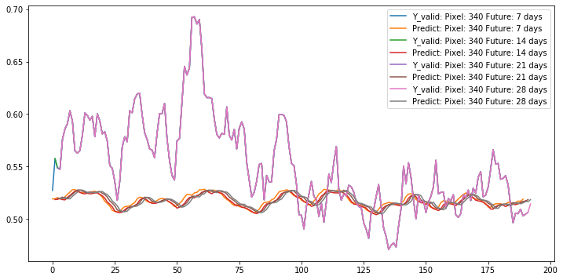{width="6.5in"
    > height="3.236111111111111in"}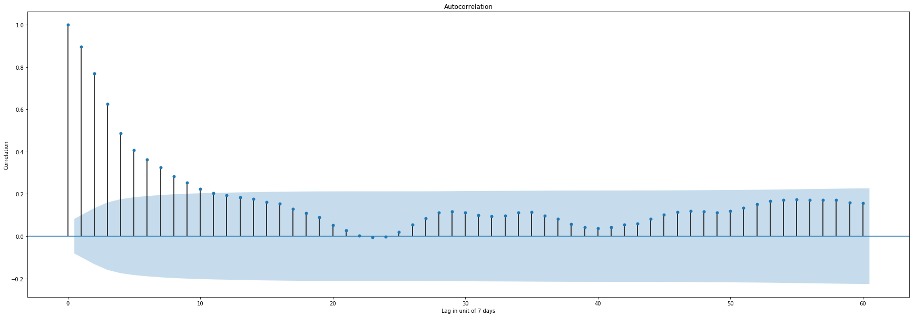{width="6.5in"
    > height="3.2083333333333335in"}

C.  Attention LSTM Encoder Decoder. X-axis: timestep unit of 7 days.
    > Y-axis scaled KDE.{width="6.5in"
    > height="3.2083333333333335in"}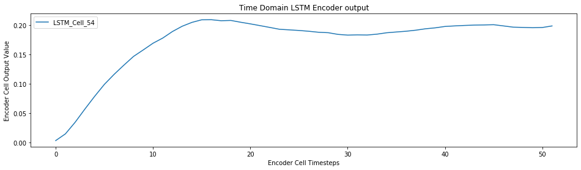{width="6.5in"
    > height="3.2222222222222223in"}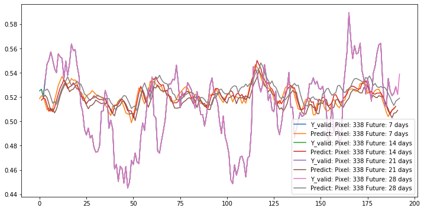{width="6.5in"
    > height="3.236111111111111in"}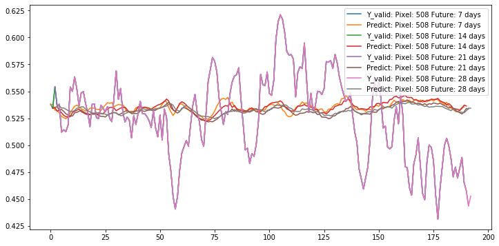{width="6.5in"
    > height="3.236111111111111in"}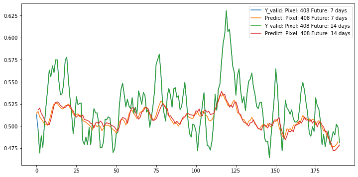{width="6.5in"
    > height="3.2083333333333335in"}

D.  Detailed Model performance comparison results

                                         Train MAE   Validation MAE   Test MAE
  -------------------------------------- ----------- ---------------- ----------
  LSTM Encoder Decoder Run 1             0.00303     0.00499          0.00788
  LSTM Encoder Decoder Run 2             0.00327     0.00508          0.00807
  LSTM Encoder Decoder Run 3             0.0031      0.00493          0.00863
  LSTM Encoder Decoder Run 4             0.00318     0.00502          0.00823
  LSTM Encoder Decoder Run 5             0.00326     0.00503          0.00788
  LSTM Encoder Attention Decoder Run 1   0.00315     0.00497          0.00828
  LSTM Encoder Attention Decoder Run 2   0.0031      0.00495          0.00805
  LSTM Encoder Attention Decoder Run 3   0.00318     0.00494          0.00795
  LSTM Encoder Attention Decoder Run 4   0.00323     0.00513          0.00801
  LSTM Encoder Attention Decoder Run 5   0.00317     0.00508          0.00796

E.  Crime Visualized in Frequency
    > Domain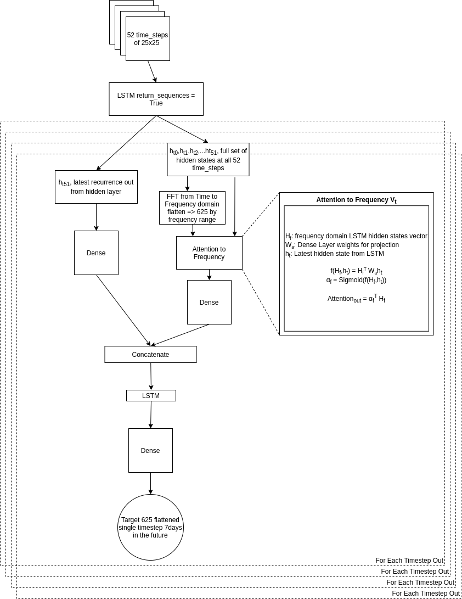{width="3.5104166666666665in"
    > height="3.65625in"}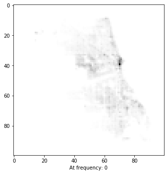{width="3.5104166666666665in"
    > height="3.65625in"}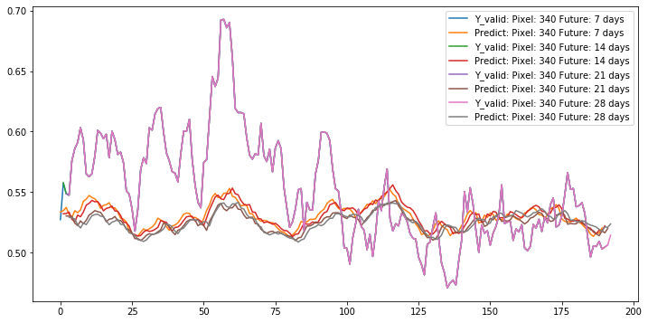{width="3.5104166666666665in"
    > height="3.65625in"}{width="3.5104166666666665in"
    > height="3.65625in"}{width="3.5104166666666665in"
    > height="3.65625in"}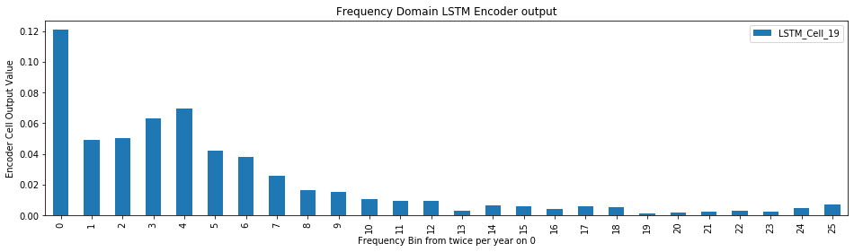{width="3.5104166666666665in"
    > height="3.65625in"}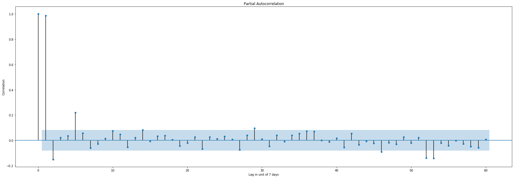{width="3.5104166666666665in"
    > height="3.65625in"}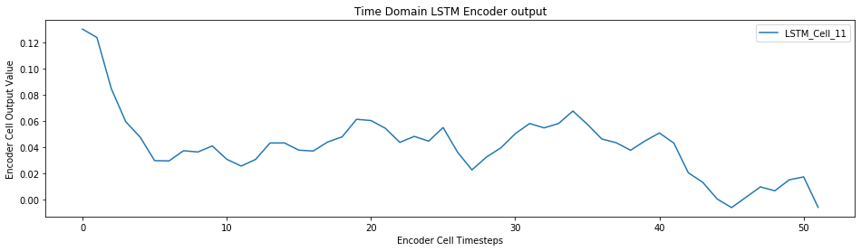{width="3.5104166666666665in"
    > height="3.65625in"}{width="3.5104166666666665in"
    > height="3.65625in"}

F.  Encoder LSTM cell Input into FFT vs Output from FFT

> 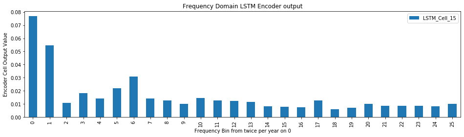{width="6.5in"
> height="1.9027777777777777in"}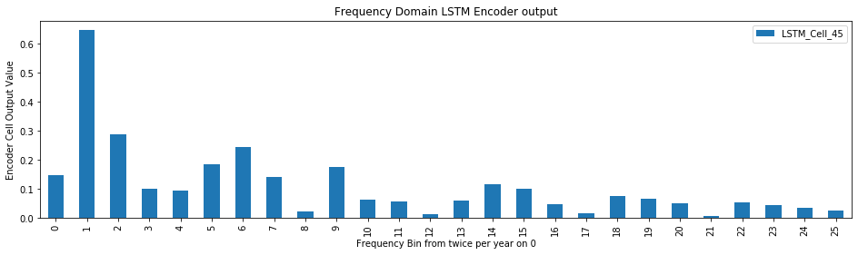{width="6.5in"
> height="1.9305555555555556in"}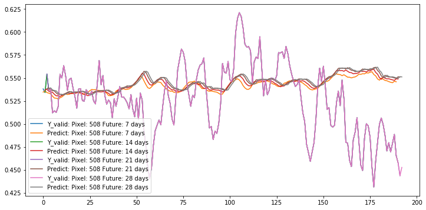{width="6.5in"
> height="1.875in"}{width="6.5in"
> height="1.9166666666666667in"}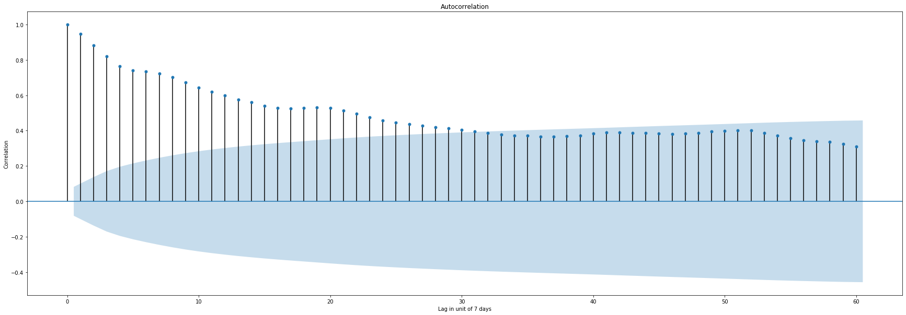{width="6.5in"
> height="1.9027777777777777in"}{width="6.5in"
> height="1.9305555555555556in"}{width="6.5in"
> height="1.8888888888888888in"}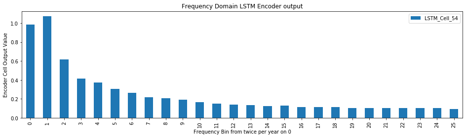{width="6.5in"
> height="1.9166666666666667in"}
>
> 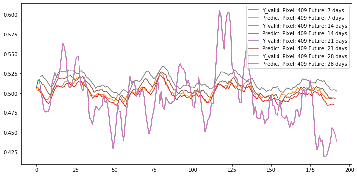{width="6.5in" height="1.9027777777777777in"}
>
> 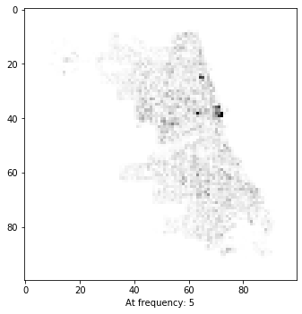{width="6.5in" height="1.9305555555555556in"}

G.  Attention versus frequency for validation
    > set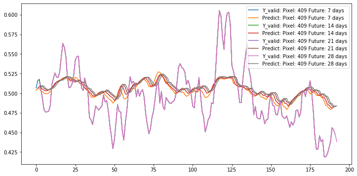{width="6.5in"
    > height="3.3472222222222223in"}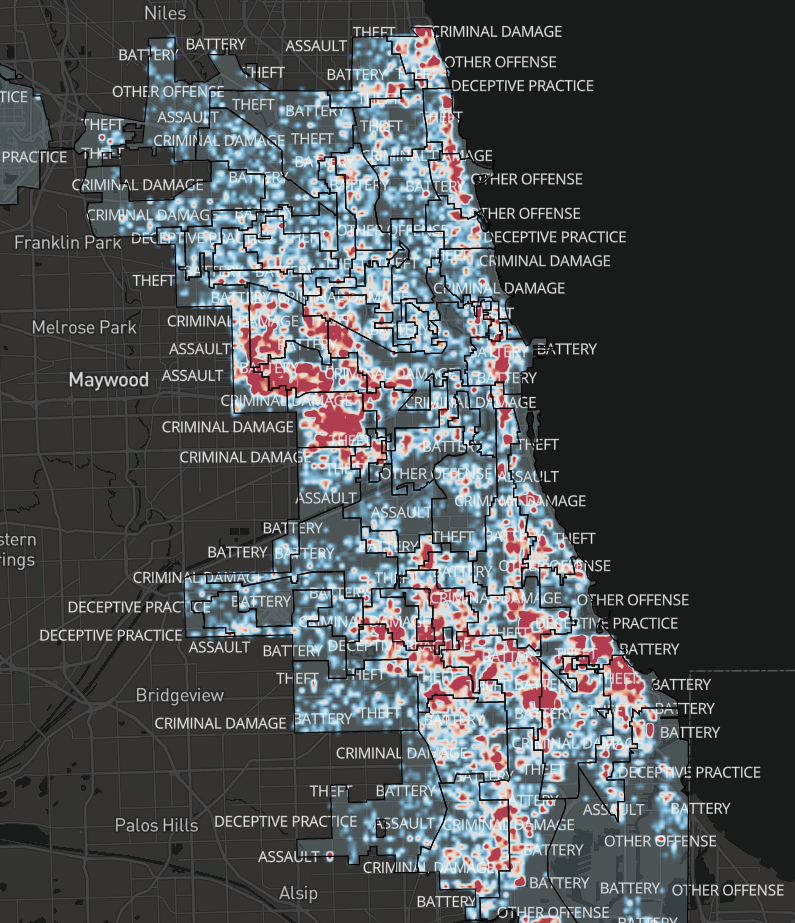{width="6.5in"
    > height="3.3472222222222223in"}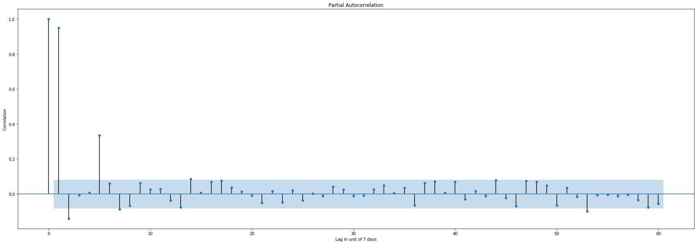{width="6.5in"
    > height="3.3472222222222223in"}

