[Direct link to research paper in HTML](researchPaper.html)

CSC 695 Masters Research

An Investigation in Chicago City Crime Prediction with
RNN plus Attention Models

Zhimin
Zou

# 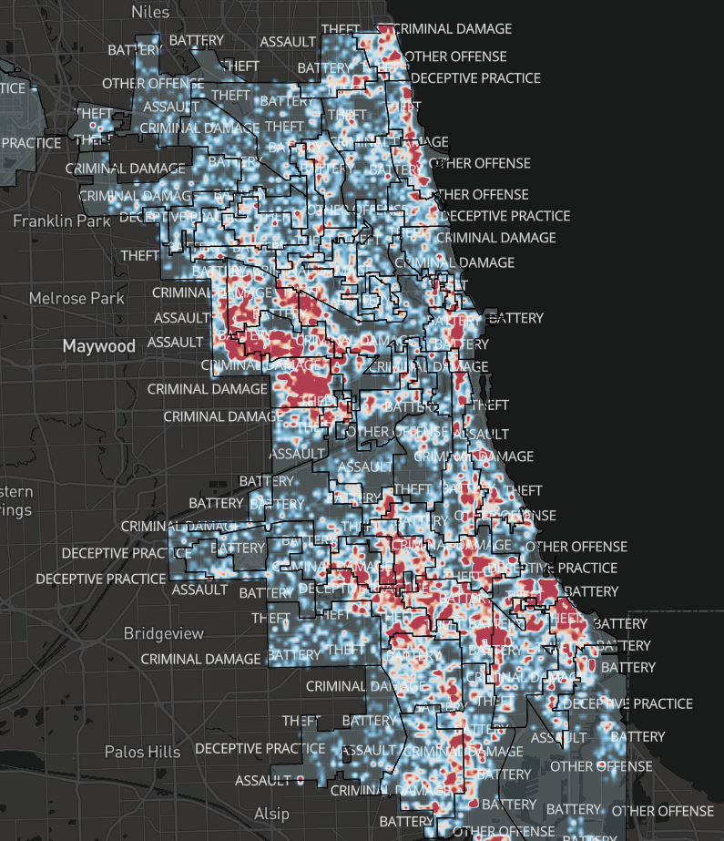

# Abstract

With techniques derived from the state-of-the-art Natural Language
Processing models, a novel Fast Fourier Transformation Attention model
has been crafted to predict the Kernel Density Estimate, KDE, of Chicago
Crime Data. Attention binded with LSTM Encoder Decoder has outperformed
LSTM Encoder Decoder in predictive power for aggregated Chicago crime
occurrences 4 week forecast. With frequency domain based context,
Attention model has been found to be more transparent and insightful
than non-attention models while providing greater performance than
its none-Attention model counterpart.

# Introduction

Crime is one of the most notable social issues in Chicago. Being
able to visualize the near future occurrence of crime can be a valuable
tool for Chicago Police Department, Hospitals, and Chicago residents.
The goal of this research is to create a model that provides the most
accurate forecast of crime in the form of Kernel Density Estimate, KDE,
of crime occurrences in spatial and time dimensions. With a forecast KDE
visualized as a heat map of near future occurrence of crime, the city of
Chicago will be able to allocate solutions to prevent crimes.

# Data Summary

## Data Source

The Chicago Data Portal has detailed records of crimes by
different categories but most importantly time and location of the crime
from 2001 to today
[\[1\]](#h.eensspbhgc0a).
Each row of this dataset represents a single occurrence of a
crime.

## Data Transformation

To achieve a macroscale visualization on the scale of a
whole city, individual instances of crime location are aggregated into a
matrix of 25 pixels by 25 pixels for a given time interval range of 30
days. The method used for this data transformation is the gaussian
Kernel Density Estimate, KDE. Each pixel is assigned a single value that
represents the density of the crime. A time dimension is created by
sliding a 30 days window with increments of 7 days. 52 slices of 25
pixels by  25 pixels matrix is created as a single sample input into the
models with the goal of predicting 4 slices of 30 days crime aggregate
information of 25 pixels by 25 pixels into the future. Each of these 4
slices are shifted with length 7 days into the future. Approximately
1000 samples were generated with crime data from January 2001 to June
2020. These 1000 samples are then split between the training set,
validation set, and test set. The data input format is a sequence of 52
and the output data format is a sequence of 4. This makes the model
presented to be sequence to sequence models. With this format, parallels
can be drawn from inspirational models from the Natural Language
Processing domain. Since time is a continuous sequence, this data format
can also be converted to many to one format. Each time step can be
generated autoregressive by using previously predicted data as input for
the next time step. The choice of choosing sequence to sequence format
is based on the ease of comparison for Attention at a varying range of
time of prediction.

## Data Exploration

As part of a data exploration and visualization, a D3.js driven
dashboard built specifically for Chicago Crime Data has been used for
data exploration
[\[2\]](#h.eensspbhgc0a).
This dashboard allows the crime to be visualized with context of the
street name and wards by leveraging Mapbox GL technology. Crime heatmap
is projected onto Mapbox in a sliding window of monthly range and
monthly interval. Crime data can be grouped by wards, crime type, and
location type. Crime data can be visualized in time series aggregate in
a 24 hours period or by the whole current year. Seasonality is observed
in a 24 hours cycle and yearly cycle during the data exploration phase
of this project. Trend is observed in the monthly time range with the
dashboard explorer.

As part of the model troubleshooting process, autocorrelation and
partial autocorrelation are charted for KDE pixels with the greatest
density. Sample of these charts are in the Appendix A section.
Autocorrelation and Partial autocorrelation charts revealed the
relationship between the most dense crime blocks has high
autocorrelation with lag 1 time step or 7 days intervals and also lag 4
to 6 time steps, which are 28 to 48 day lags. Autocorrelation gave
insight to the understanding of the crime without relation to
neighboring pixels or locations. Traditional ARIMA models will be well
suited if there is no correlation between crime of nearby locations.
However, by intuition and data visualization, there will be correlations
between features or pixels in our data. For this reason, various neural
network models will be used to capture these cross-correlation location
dependencies.

# Methods

Various Neural Network models are explored to test the
capability of the predictive power. The loss function used for these
models is Mean Absolute Error, MAE. With the inputs to the model
formatted as 52 slices of KDE and output of the model formatted as 4
slices of KDE, the network is defined as a sequence to sequence
model.

The data set is split into 60 percent of the samples
for training, 20 percent for validation, and 20 percent for testing. The
training set is used to generate the min and max scale for min-max
scaler to achieve the value range of 0 to 1.0. This scaler is then
applied to the validation and test set.

## Figure 1a Encoder Decoder Model

## Encoder Decoder Model

The encoder decoder model is the most simple Neural Network
sequence to sequence model. The typical application for this model is
Natural Language Processing, specifically translation. An encoder
decoder model consists of two sections. The first section is a single
layer Encoder LSTM with 100 units. After stepping through 52 slices of
the flattened 25 by 25 pixels as time step, the latest hidden state of
the Encoder LSTM out is copied 4 times. This creates 4 slices or time
steps which are then inputted into the Decoder LSTM layer. The decoder
LSTM layer is set to return the full sequence of its hidden states. This
allows the output to create a tensor with dimensions as  (sample\_size,
time step, features). See Figure
1a for model architecture
diagram.

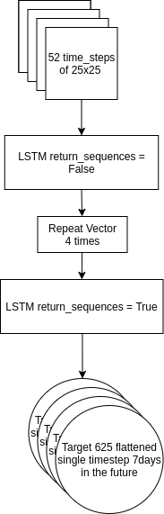The
2 layer LSTM Encoder Decoder model performed extremely well in capturing
the relationship between the time steps and the relationships between
pixels. The validation set MAE is 0.00501 and test set MAE is 0.008138.
The average error is less than 1% of the respective pixel value which
can range from approximately 0 to 1.0 after being scaled. Notably, there
has been a sharp change in crime patterns in the test set data due to
COVID-19 being in the test set data as the test set is the last 200
samples of the time series.

The output of this model in validation set is charted as pixel
wise time series to examine the trend, cycle, and seasonal captured by
the model. The prediction for each sample given the pixel number is
captured with the same absolute time for a given time enumeration on
x-axis. This is achieved by padding the front of the predicted pixel
wise time series with empty values to align them to reference the same
week for a given x-axis value. These charts can be found in Appendix
B.

## Attention Models

In the recent conception of the Transformer model in Natural
Language Processing, Attention has been researched and applied in a
variety of different fields such as translation, sentence generation,
image generation and time series
[\[3\]](#h.eensspbhgc0a).
Attention allows the network to skip superfluous information being
propagated in the training process. The big concept of Attention is
assigning weights to features that are more correlated to efficiently
generate the correct prediction under given context of the
prediction.

While there are many parallels in processing time series data
versus processing sentences, NLP style Attention cannot be directly
applied to time series data. There are limitations to traditional
attention from natural language processing in time series. Typically,
the weight vector of Attention is divided between timesteps or in NLP
words. The results of the output for NLP styled Attention is generating
a sentence where each time step is a single word embedding.
Specifically, in NEURAL MACHINE TRANSLATION BY
JOINTLY LEARNING TO ALIGN AND TRANSLATE
[\[4\]](#h.eensspbhgc0a), context
vector is defined for each word,
i. The attention weight
is defined in word i and annotations
 j dimensions. In order to generate context, the annotation j dimension
is aggregated together as sum. This collapses sequential information of
previous RNN hidden state . Each
attention is based on a single time step in RNN hidden state. Using this
style of Attention multivariate time series is limited. A correlation of
many time steps to one time step can certainly be derived in seasonal
forecasting. NLP style Attention mechanism
averages information over multiple time steps, therefore attending to
time steps is not the optimal solution in multivariate time series
[\[5\]](#h.eensspbhgc0a).

Inspired by the 1D-CNN with Attention to features model presented
in Temporal Pattern Attention for Multivariate
Time Series Forecasting, leveraging Attention
mechanisms to capture important information for given context. A novel
Fast Fourier Transformation, FFT, Attention has been found to be the
most optimal in time series forecasting crime data. In order to
circumvent the limitation of selecting a single relevant time step for
attention weight, Temporal Pattern Attention for
Multivariate Time Series Forecasting presented an Attention
model that selects the most relevant time series, which has multiple
timesteps information factored into context vector
. Temporal
Pattern Attention for Multivariate Time Series
Forecasting highlighted the limitation of using a single
time step since in order to predict time series patterns, changes in
multiple time steps have been factored into a single time step forecast.

An alternative frequency dimension is generated to
circumvent this limitation. In order to capture the many time steps to
one dependency in Attention mechanism, a summary of the time range’s
seasonal and trend information is captured into a vector representation.
FFT is used to achieve this summary of time range seasonal and trend
information which contains multiple timesteps information for a given
frequency. FFT is chosen particularly, for it is a computationally
efficient implementation of Discrete Fourier Transformation, DFT that is
widely available as a standard library.

At a high level, DFT measures the correlation or similarity
between the input time domain data with a discrete set of varying period
sinusoidal functions. These different frequency domain waves are
effectively possible seasons in the input data with incremental
variation in periods. In the equation below,
 represents the original discrete
time series signal where  is the
value of crime density from 1 to 52 weeks. N is the top range of
frequency bins. N is limited to less than 52 weeks for DFT. For
TensorFlow implementation of Real FFT, N is set to be Nyquist rate,
minimum rate which finite bandwidth needs to be sampled to retain
complete information, of 0.5 of sampling time interval of 52 weeks plus
0 frequency bin which is 27 frequency bins. Effectively, the 0 frequency
bin of the discrete series of DFT is the mean. The term
is a standard sinusoidal wave at the
given frequency bin n decomposed in discrete form to match
. The following DFT equation below
measures shows that a similarity measure is taken per frequency bin for
the term  and
. Figure 4 below shows two
encoder LSTM cell outputs that demonstrate the time domain versus
frequency domain.

DFT:  where k = 0,1,...N-1 and

With the 2 layer encoder decoder LSTM model as foundation,
Attention mechanism is applied to the hidden states of the encoder. See
Figure 1b for model
architecture diagram. With the transformed 100 unit encoder LSTM hidden
states from time steps of 52 into frequency domain of 27, the output of
the FFT is a tensor with shape of 27 frequency by 100 LSTM unit where
each of the 27 frequency is a summary of the seasonality at an
incremental increase in period by 7 days with 7 days as the highest
frequency and 196 days as the lowest frequency. Visualization of 52 days
of crime KDE at various frequencies is in Appendix E.

<table>
<colgroup>
<col style="width: 50%" />
<col style="width: 50%" />
</colgroup>
<tbody>
<tr class="odd">
<td>
Hf: Frequency domain LSTM hidden states vector

Wa: Dense Layer weights for projection

ht: Latest hidden state from LSTM
</td>
<td>
f(Hf,ht) = HfT Waht

αf = Sigmoid(f(Hf,ht))

Attentionout = αfT Hf
</td>
</tr>
</tbody>
</table>

In order to attend to LSTM out in frequency domain
Hf, a similarity measure between
the latest encoder LSTM hidden state
ht and
Hf. To keep the output dimension
in frequency domain , a dense layer
Wa is applied to the latest hidden
layer in the time domain. The inner product of
Hf and
Waht is
then applied to with the sigmoid activation function to create a
similarity score per frequency to produce a normalized attention weight
. Each LSTM unit frequency domain
vector is then summarized in frequency with the inner product of
 and
Hf giving each LSTM
cell unit aggregate value based on the most relevant frequencies summed
together. This allows pixel wise information to be represented across
multiple time
steps.

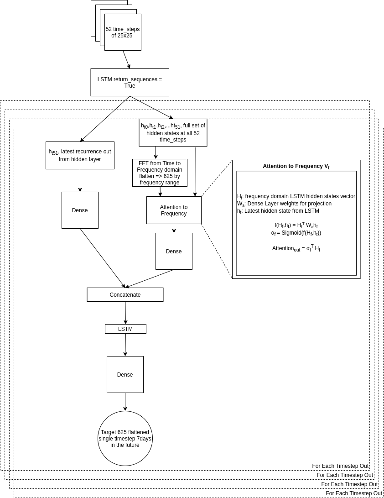

Figure 1b: LSTM Attention to Frequency Domain Hidden
States

Both hidden states in time dimension
ht and weighted hidden state
Attentionout from
Attention are then applied with a dense layer and then concatenated to
form the hidden representation for the decoder LSTM with 100 units. A
final dense layer is then applied on the output of the LSTM unit for
transforming the output into the original input feature shape of 625
pixels or 25 by 25 pixels.

With the encoder decoder architecture, each output time step can
be attended independently with different sets of weights. This allows
each of the decoder LSTM units to focus on different parts of the
encoder LSTM outputs. For output with 4 time steps, 4 different
attention heads are stacked to form a tensor of 4 time steps by 625
pixels out. Although the model is a sequence to sequence model, it is
not autoregressive where the following sequence is based on the current
sequence generated. All 4 time steps are generated based on the same 52
week of input data.

# Results

Models are compared with similar parameters with batch
size of 21 samples. Learning rate of 0.001, ADAM optimizer and Mean
Absolute Error for the loss function. Both models are trained with 500
epochs or early stop on condition of validation MAE does not make
further improvement in the last 50
epochs.

|                                                                      |                                   |                                        |                                   |
| -------------------------------------------------------------------- | --------------------------------- | -------------------------------------- | --------------------------------- |
|                                              | Train MAE | Validation MAE | Test MAE |
| LSTM Encoder Decoder 5 Run Average           | 0.003168  | 0.00501        | 0.008138 |
| LSTM Encoder Attention Decoder 5 Run Average | 0.003166  | 0.005014       | 0.00805  |

Figure 2: Model Performance Comparison

The LSTM Encoder Decoder with Attention matched the
performance of a LSTM Encoder Decoder. Within 5 runs, the Attention
model slightly surpassed Encoder Decoder model by 1.1 percent. While
this is not significant in predictive power, Attention models provide
more insight into the data and model themselves. 

After weights are trained, validation set is used to chart the
Attention weights vector .

Figure 3a. Attention on LSTM frequency

Figure 3a above shows Attention weights
 with respect to frequency
on the 7 days future prediction. Each individual line represents trained
Attention weight for a given single sample of 52 weeks. There is
significant Attention on higher frequency for predicting the next 7 days
into the future. In other words, the higher frequency updates in the
time dimension of 52 weeks are significantly contributing to making near
term 7 days predictions. The higher frequencies from the FFT output
vector represent correlation values of shorter period time series
changes in encoder LSTM out. The function of  the encoder is to
transform the current time step information to generate the encoder
vector. The encoder LSTM time step outputs are directly correlated to
the input time step values. Information of the latest value change is
captured in this encoded vector. By observing the model looking at short
term fluctuations instead of long term seasonality and trends, it can be
concluded that predictions are made based on near term training data.
This result is consistent with the autocorrelation plot of the
validation set provided in Appendix A, where the significant
autocorrelation lags of each pixel in KDE map is within 5 to 6 weeks.

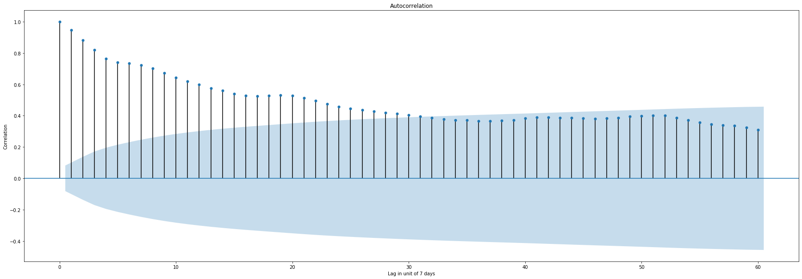

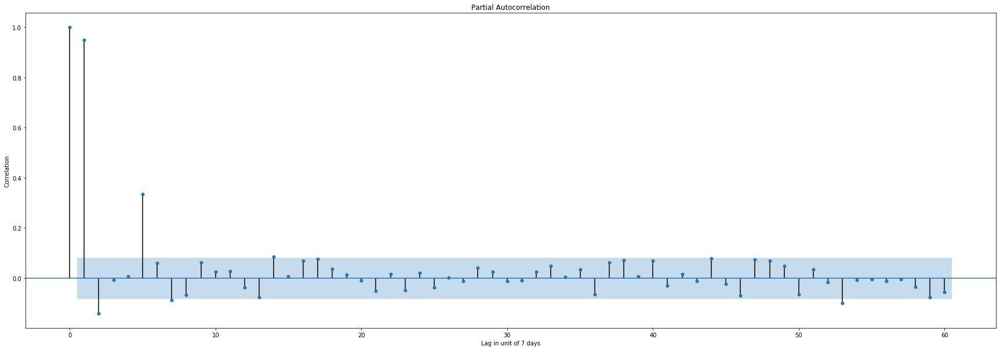

Figure 3b. ACF and PACF of the Densest Pixel

The Attention weights are charted for 14 days, 21 days,
and 28 days into the future in Appendix G. There are no significant
changes in the Attention distribution as the prediction period moves
into the more distant future.

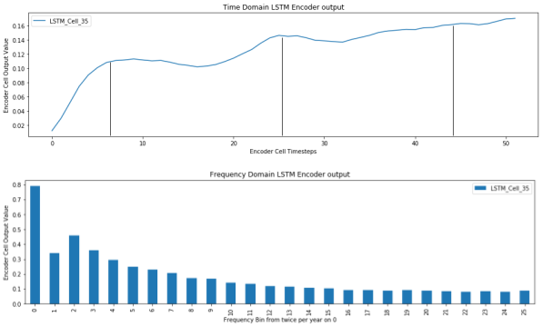

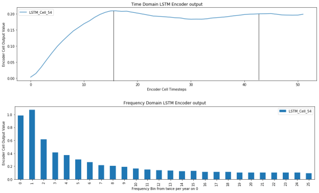

Figure 4: Time vs Frequency Domain with labeled
peaks

Further examining the encoder portion of Attention FFT model
revealed specialization of each encoder LSTM cell in capturing a unique
set of input information. Above plots in Figure 4 are outputs from
encoder LSTM cells that capture approximately singular frequency that
can be easily visually identified. Closely observing the rest of the
encoder LSTM cell output in time and frequency domain in Appendix F, it
can be found that each encoder LSTM cell output specialized in a
particular set of model inputs as visualization shows there are
variations in time step patterns being outputted by the LSTM cell
unit.

NEURAL MACHINE TRANSLATION BY JOINTLY LEARNING TO ALIGN
AND TRANSLATE 2015
[\[4\]](#h.eensspbhgc0a),
revealed performance comparison of the test set
results for sentence translation with sentence length from 0 to 60 word
count. It was found that the Attention model starts to outperform RNN
Encoder Decoder model at translating sentences that contain 20 or more
words with training data containing up to 50 words. Since each word is a
time step in sequence to sequence sentence translation is a single word,
this is equivalent to having autocorrelation between aggregated crime
data that are approximately 50 time steps apart. With the tested data
format of 7 days as a single time step, the benefit of Attention did not
present itself. 

As a post-mortem reflection to the existing comparison of the two
models and the tested  data format, Attention models may see stronger
predictive power compared with Encoder Decoder RNN model, when time step
is reduced to a single day from a 7 day window. This shortened time step
format would require the model to recall events in a 7 time longer
sequence as autocorrelation lags are exacerbated by the shortened time
step unit.

# Conclusions

A novel Encoder Decoder and Attention model is tested and compared
with the Chicago crime data. The result matched and slightly improved on
a layer LSTM Encoder Decoder model. Attention model did not provide
significant improvements in predictive power for Chicago crime density
in time series. This is due to the lack of long term dependencies in
crime occurrences. Crime occurrences typically autocorrelate with the
past 5 to 6 weeks of its past history at a given aggregate location.
Attention model provided transparency over traditional RNN
models.

# 

# References

\[1\] "Crimes - 2001 to Present | Socrata API
Foundry." 30 Sep. 2011,
[https://dev.socrata.com/foundry/data.cityofchicago.org/ijzp-q8t2](https://www.google.com/url?q=https://dev.socrata.com/foundry/data.cityofchicago.org/ijzp-q8t2&sa=D&ust=1600125092441000&usg=AOvVaw3iWIPHnRZlWpXaQktL1gdG).
Accessed 9 Aug. 2020.

\[2\] Zou, Zhimin, et al. “Chicago Crime Data.”
Chicago,
[https://chicago-crime-data-468.herokuapp.com/](https://www.google.com/url?q=https://chicago-crime-data-468.herokuapp.com/&sa=D&ust=1600125092442000&usg=AOvVaw2727ULnXWUmcM8kRfNCEkb).
A Dashboard for Visualizing Chicago Crime

\[3\] Vaswani, A., et al.
"Attention is all you need. arXiv 2017."
arXiv preprint
arXiv:1706.03762 (2017).

\[4\] Bahdanau, Dzmitry,
Kyunghyun Cho, and Yoshua Bengio. "Neural machine translation by jointly
learning to align and translate." arXiv
preprint arXiv:1409.0473 (2014).

\[5\] Shih, Shun-Yao,
Fan-Keng Sun, and Hung-yi Lee. "Temporal pattern attention for
multivariate time series forecasting."
Machine
Learning 108.8-9 (2019): 1421-1441.

-----

# 

# Appendices

1.  Autocorrelation and Partial Autocorrelation of
    training set ordered from the densest
pixel

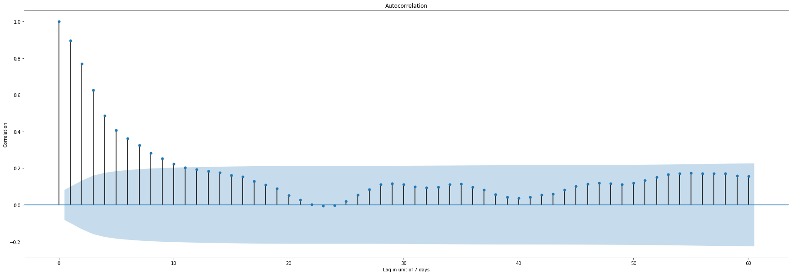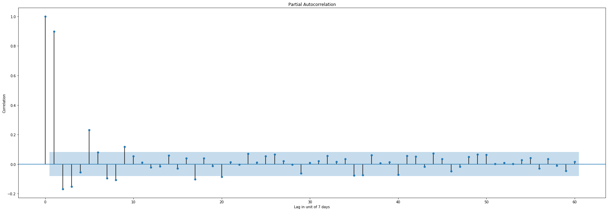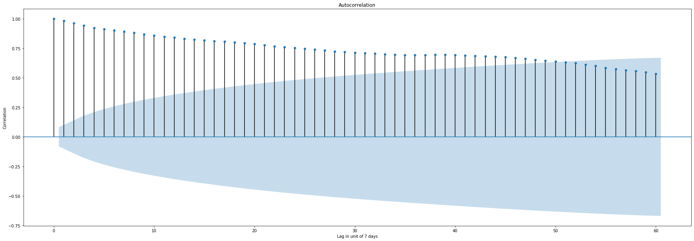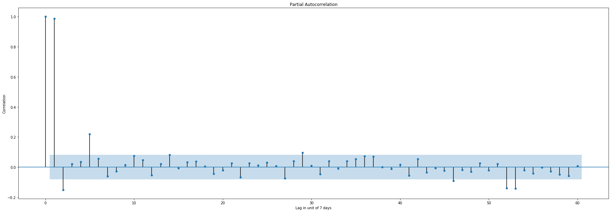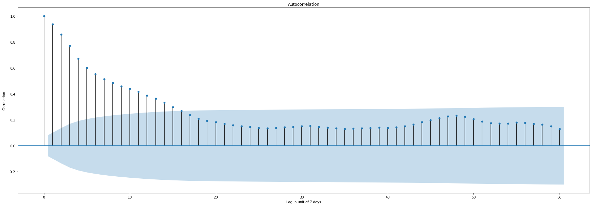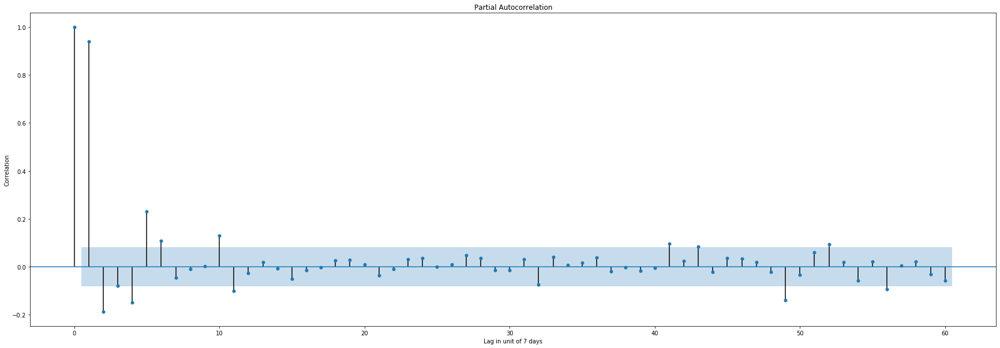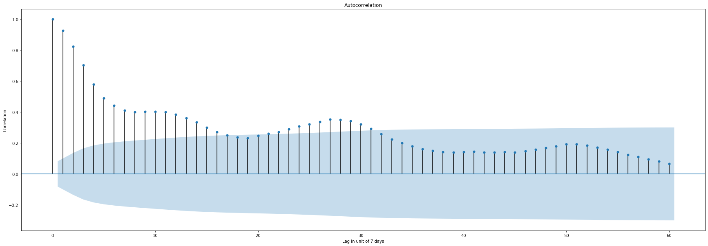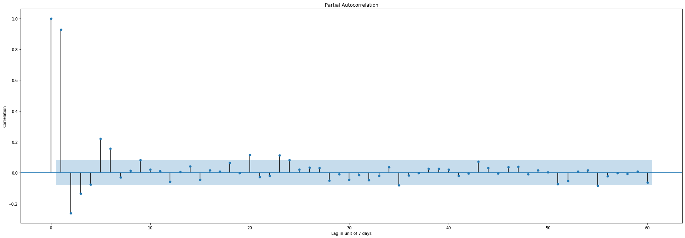

2.  Pixel wise time series of validation set prediction X-axis:
    timestep unit of 7 days. Y-axis scaled
    KDE.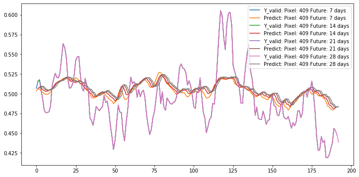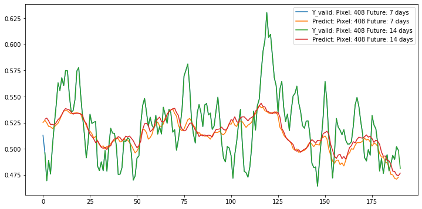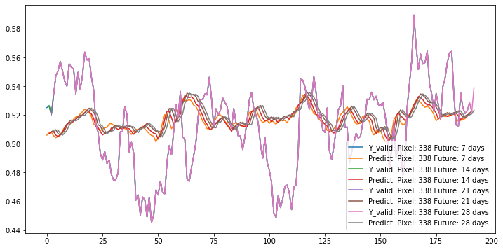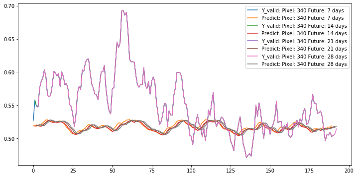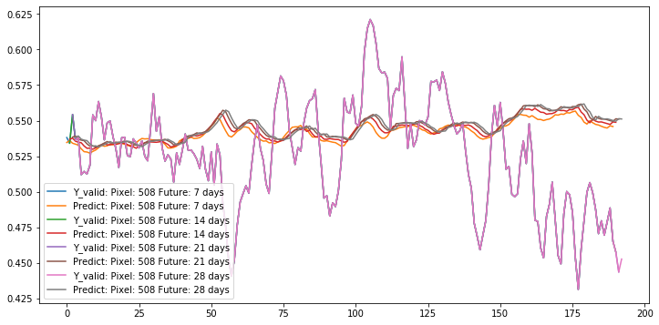
3.  Attention LSTM Encoder Decoder. X-axis: timestep unit of 7
    days. Y-axis scaled
    KDE.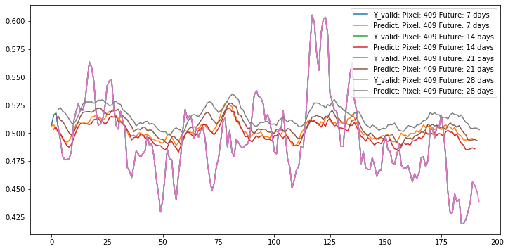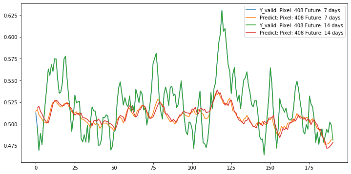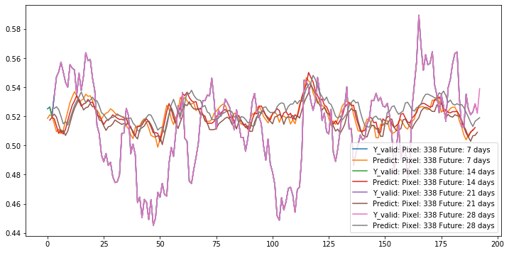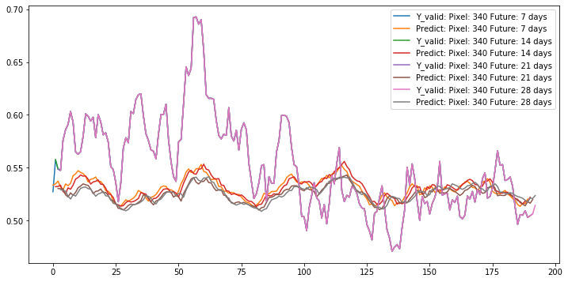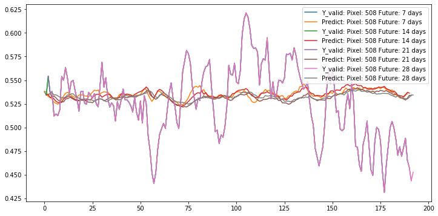

4.  Detailed Model performance comparison
    results

|                                                              |                                   |                                        |                                  |
| ------------------------------------------------------------ | --------------------------------- | -------------------------------------- | -------------------------------- |
|                                      | Train MAE | Validation MAE | Test MAE |
| LSTM Encoder Decoder Run 1           | 0.00303   | 0.00499        | 0.00788  |
| LSTM Encoder Decoder Run 2           | 0.00327   | 0.00508        | 0.00807  |
| LSTM Encoder Decoder Run 3           | 0.0031    | 0.00493        | 0.00863  |
| LSTM Encoder Decoder Run 4           | 0.00318   | 0.00502        | 0.00823  |
| LSTM Encoder Decoder Run 5           | 0.00326   | 0.00503        | 0.00788  |
| LSTM Encoder Attention Decoder Run 1 | 0.00315   | 0.00497        | 0.00828  |
| LSTM Encoder Attention Decoder Run 2 | 0.0031    | 0.00495        | 0.00805  |
| LSTM Encoder Attention Decoder Run 3 | 0.00318   | 0.00494        | 0.00795  |
| LSTM Encoder Attention Decoder Run 4 | 0.00323   | 0.00513        | 0.00801  |
| LSTM Encoder Attention Decoder Run 5 | 0.00317   | 0.00508        | 0.00796  |

5.  Crime Visualized in Frequency
    Domain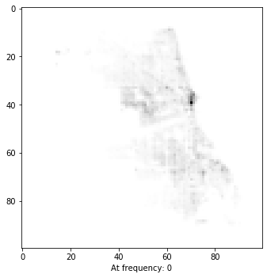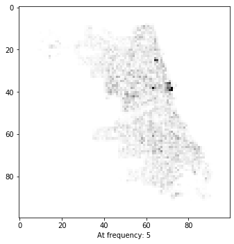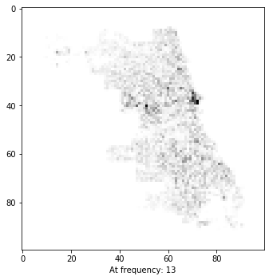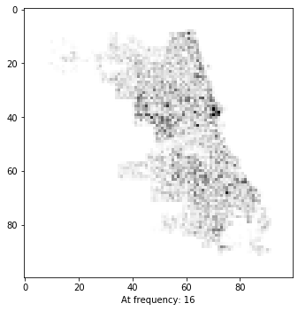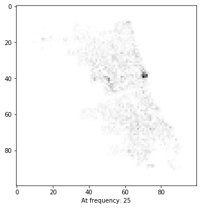
6.  Encoder LSTM cell Input into FFT vs Output from
    FFT

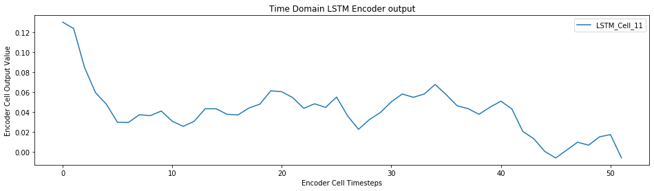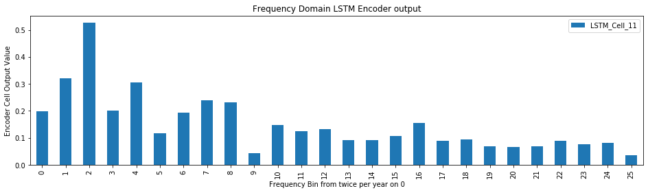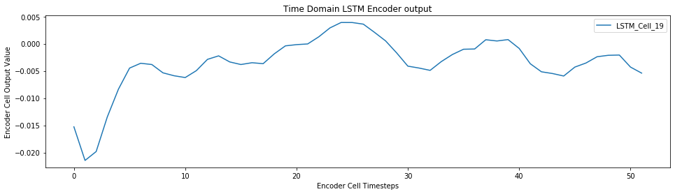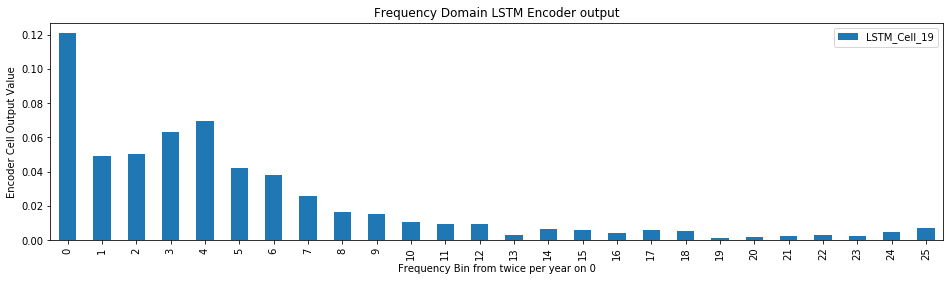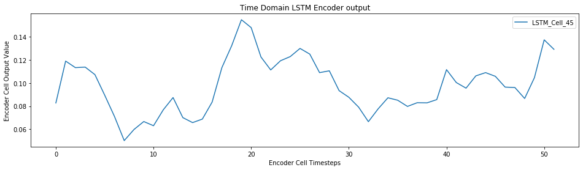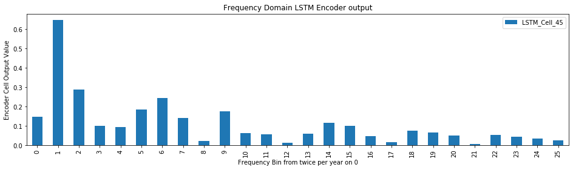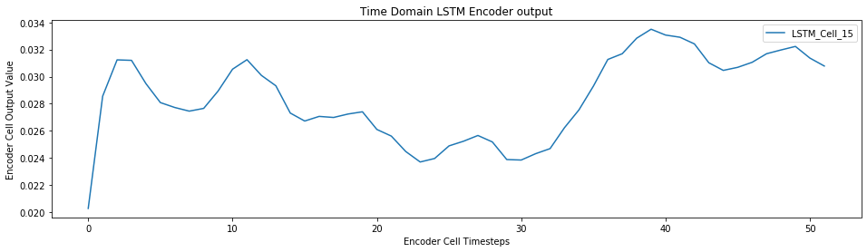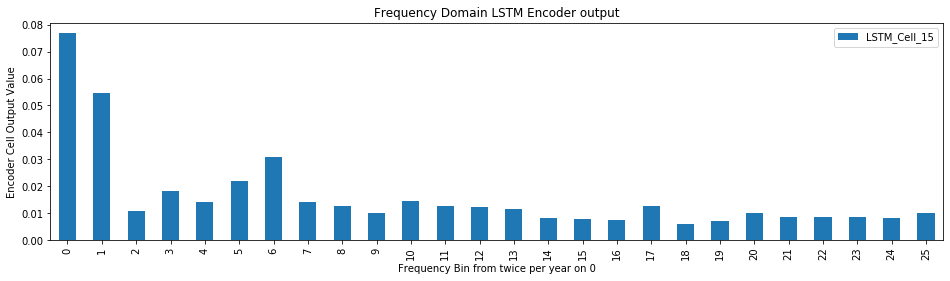

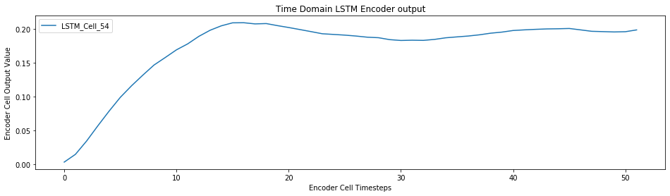

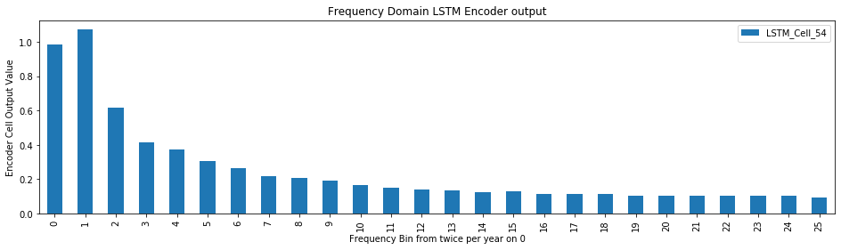

7.  Attention versus frequency for validation
    set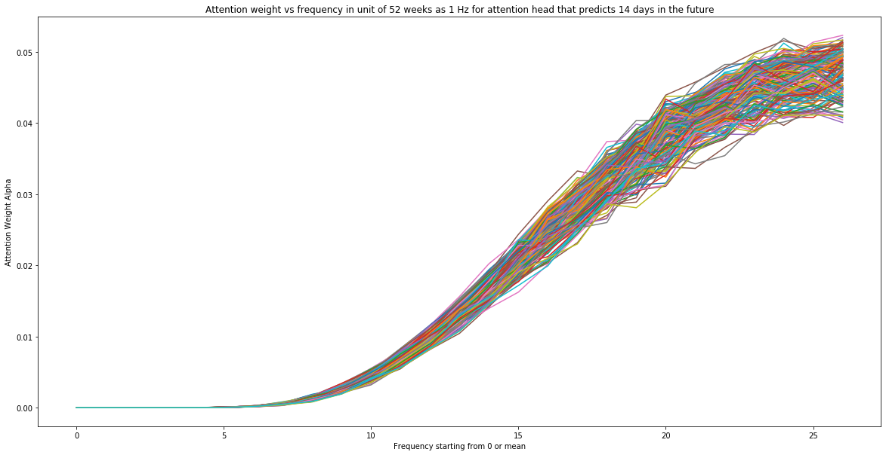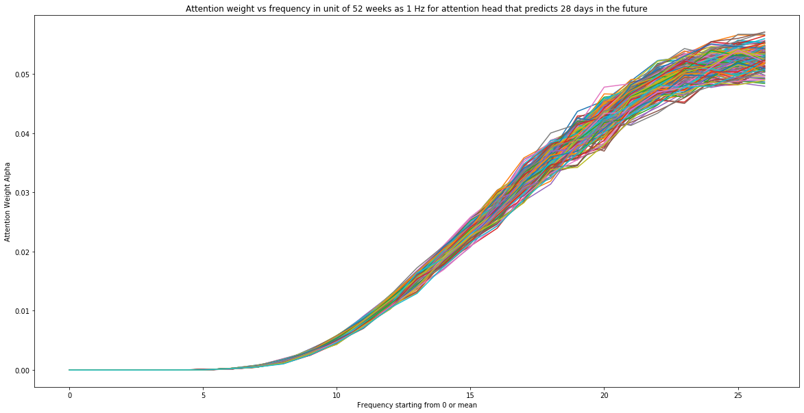

